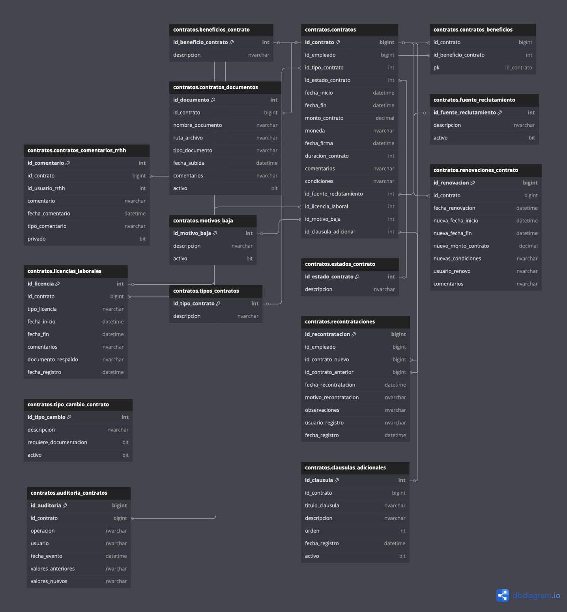

# Módulo de Contratos (Esquema `contratos`)

El esquema `contratos` gestiona toda la información relacionada con los contratos laborales de los empleados, incluyendo renovaciones, beneficios, recontrataciones, licencias, cláusulas adicionales, entre otros.

## ¿Qué es el esquema `contratos`? 📄

El esquema `contratos` agrupa todas las entidades que permiten almacenar, consultar y auditar los contratos laborales de los empleados dentro de la organización. Está diseñado para integrarse con el esquema `empleados` y otros catálogos normativos.

Incluye funcionalidades para:

- Registro de contratos y sus fechas clave.
- Recontrataciones o renovaciones de contrato.
- Beneficios asociados a un contrato.
- Licencias aplicables a un contrato.
- Cláusulas personalizadas o adicionales.

## ¿Por qué es importante el esquema `contratos`? 🧾

Este esquema permite tener un control detallado y auditable sobre los contratos laborales, lo cual es fundamental para el cumplimiento de las normativas laborales, la gestión eficiente de recursos humanos y el control de beneficios o derechos adquiridos.

Entre sus beneficios están:

- **Seguimiento histórico** de contratos por empleado.
- **Control y asignación de beneficios laborales**.
- **Auditoría** de renovaciones, licencias o recontrataciones.
- **Gestión flexible** de cláusulas contractuales adicionales.

## Tablas destacadas del esquema `contratos` 📊

### 1. `contratos`

- **Descripción**: Tabla principal que registra los contratos laborales.
- **Campos importantes**:
  - `id_contrato`: Identificador único del contrato.
  - `id_empleado`: Relación con la tabla `empleados`.
  - `fecha_inicio`, `fecha_fin`: Vigencia del contrato.
  - `activo`: Indica si el contrato sigue vigente.

### 2. `renovaciones_contrato`

- **Descripción**: Almacena las renovaciones o recontrataciones relacionadas con un contrato original.
- **Campos importantes**:
  - `id_renovacion`: Identificador único.
  - `id_contrato_origen`: Contrato base.
  - `id_contrato_nuevo`: Nuevo contrato que da continuidad.
  - `fecha_registro`: Fecha en que se registró la renovación.

### 3. `beneficios_contrato`

- **Descripción**: Representa los beneficios laborales asociados a un contrato.
- **Campos importantes**:
  - `id_beneficio_contrato`: Identificador del beneficio.
  - `id_contrato`: Contrato relacionado.
  - `id_beneficio`: Referencia al catálogo de beneficios.
  - `activo`: Si el beneficio está vigente.

### 4. `licencias_contrato`

- **Descripción**: Registra las licencias otorgadas dentro del periodo de vigencia del contrato.
- **Campos importantes**:
  - `id_licencia_contrato`: Identificador de la licencia.
  - `id_contrato`: Contrato al que aplica.
  - `id_licencia`: Tipo de licencia (ej. maternidad, incapacidad).
  - `fecha_inicio`, `fecha_fin`: Periodo de la licencia.

### 5. `clausulas_adicionales`

- **Descripción**: Almacena cláusulas personalizadas para contratos específicos.
- **Campos importantes**:
  - `id_clausula`: Identificador único.
  - `id_contrato`: Contrato al que pertenece.
  - `titulo_clausula`, `descripcion`: Detalle de la cláusula.
  - `orden`: Para ordenarlas en la presentación del contrato.

## Relación entre tablas 🔗

Las tablas del esquema `contratos` están interrelacionadas para mantener la integridad y trazabilidad de los datos:

- `contratos` se relaciona con `empleados` mediante `id_empleado`.
- `renovaciones_contrato` conecta contratos previos y nuevos.
- `beneficios_contrato` y `licencias_contrato` dependen del `id_contrato`.
- `clausulas_adicionales` permite extensibilidad de contenido contractual.

## ¿Cómo usar el esquema `contratos`? 🛠️

Este esquema permite consultar, insertar y auditar la información contractual de los empleados. Algunos ejemplos de uso:

- Consultar todos los contratos vigentes de un empleado.
- Revisar qué beneficios están asociados a determinado contrato.
- Auditar cuántas renovaciones ha tenido un contrato.
- Obtener un resumen completo de las cláusulas personalizadas para un contrato.

## Beneficios de integrar el esquema `contratos` 💼

- Facilita la **administración legal y laboral** de los contratos.
- Mejora la **gestión documental** y el cumplimiento normativo.
- Permite la **generación automatizada de reportes contractuales**.
- Brinda mayor **transparencia en la relación laboral** con los empleados.

Este módulo es esencial para un sistema integral de recursos humanos que requiere trazabilidad, control y legalidad en los contratos de trabajo.
