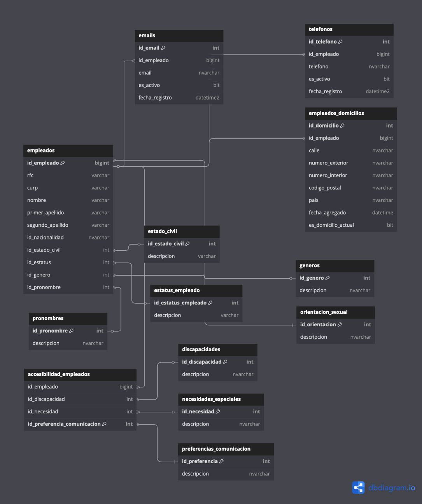

# Catálogo de Empleados (Esquema `empleados`)

El esquema `empleados` contiene la información relacionada con los empleados de una organización. Es utilizado para almacenar y gestionar los datos personales, de contacto, estado civil, estatus laboral y más, de los colaboradores.

## ¿Qué es el esquema `empleados`? 👥

El esquema `empleados` agrupa las tablas relacionadas con los empleados y su información laboral. Cada tabla está diseñada para almacenar un tipo específico de datos sobre los empleados, y está vinculada con otras a través de claves foráneas. Algunas de las áreas cubiertas en este esquema incluyen:

- **Datos personales**: Información básica como nombre, RFC, CURP, etc.
- **Contacto**: Correos electrónicos, números de teléfono, domicilios.
- **Estado civil y estatus laboral**: Relacionados con la situación personal y laboral de cada empleado.
- **Preferencias de comunicación y accesibilidad**: Información sobre cómo se prefiere que el empleado sea contactado o si tiene alguna discapacidad o necesidad especial.

## ¿Por qué es importante el esquema `empleados`? 🏢

El esquema `empleados` permite a las empresas gestionar de manera estructurada y eficiente los datos fundamentales de sus empleados. Entre los beneficios destacan:

- **Organización y acceso rápido** a la información de cada empleado.
- **Cumplimiento normativo** al tener un registro detallado de los datos fiscales, personales y laborales.
- **Automatización de procesos** de gestión de recursos humanos, nómina, etc.
- **Facilidad para generar reportes** relacionados con la plantilla laboral y su estatus.

## Tablas destacadas del esquema `empleados` 📊

### 1. `empleados`

- **Descripción**: Almacena la información básica de los empleados, como nombre, RFC, CURP, estado civil, estatus laboral, etc.
- **Campos importantes**:
  - `id_empleado`: Identificador único del empleado.
  - `rfc`: Registro Federal de Contribuyentes.
  - `curp`: Clave Única de Registro de Población.
  - `nombre`, `primer_apellido`, `segundo_apellido`: Datos personales.
  - `id_estado_civil`, `id_estatus`: Referencias a tablas relacionadas con el estado civil y estatus laboral.

### 2. `emails`

- **Descripción**: Contiene la información de los correos electrónicos de los empleados.
- **Campos importantes**:
  - `id_email`: Identificador único del correo electrónico.
  - `id_empleado`: Relacionado con la tabla `empleados`.
  - `email`: Dirección de correo electrónico.
  - `es_activo`: Indica si el correo está activo.

### 3. `telefonos`

- **Descripción**: Almacena los números de teléfono de los empleados.
- **Campos importantes**:
  - `id_telefono`: Identificador único del teléfono.
  - `id_empleado`: Relacionado con la tabla `empleados`.
  - `telefono`: Número de teléfono.
  - `es_activo`: Indica si el teléfono está activo.

### 4. `empleados_domicilios`

- **Descripción**: Información sobre los domicilios de los empleados.
- **Campos importantes**:
  - `id_domicilio`: Identificador único del domicilio.
  - `id_empleado`: Relacionado con la tabla `empleados`.
  - `calle`, `numero_exterior`, `numero_interior`: Dirección del domicilio.
  - `codigo_postal`, `pais`: Información geográfica.

### 5. `accesibilidad_empleados`

- **Descripción**: Relaciona las discapacidades, necesidades especiales y preferencias de comunicación de los empleados.
- **Campos importantes**:
  - `id_empleado`: Relacionado con la tabla `empleados`.
  - `id_discapacidad`, `id_necesidad`, `id_preferencia_comunicacion`: Referencias a tablas relacionadas con accesibilidad y preferencias de comunicación.

### 6. `estatus_empleado`

- **Descripción**: Define los diferentes estatus laborales que un empleado puede tener.
- **Campos importantes**:
  - `id_estatus_empleado`: Identificador del estatus.
  - `descripcion`: Descripción del estatus (ej. activo, inactivo, licencia, etc.).

## Relación entre tablas 🔗

Las tablas del esquema `empleados` están interrelacionadas mediante claves foráneas que permiten gestionar la información de manera coherente y estructurada:

- La tabla `empleados` tiene claves foráneas que se vinculan a las tablas `estado_civil`, `estatus_empleado`, `generos`, `pronombres`, y `cfdi_40_paises`.
- La tabla `emails` se asocia a `empleados` mediante `id_empleado`.
- La tabla `telefonos` también se relaciona con `empleados` por `id_empleado`.
- La tabla `empleados_domicilios` se vincula a `empleados` a través de `id_empleado`.
- La tabla `accesibilidad_empleados` se conecta a las tablas `discapacidades`, `necesidades_especiales`, y `preferencias_comunicacion`.

## ¿Cómo usar el esquema `empleados`? 🛠️

Este esquema se utiliza para gestionar los datos de los empleados en una base de datos SQL. Puedes realizar consultas para obtener información específica sobre los empleados, como:

- Obtener todos los correos electrónicos activos de un empleado.
- Consultar el estado civil y estatus laboral de un empleado.
- Listar los domicilios de un empleado.
- Ver la accesibilidad y las necesidades especiales de un empleado.

## Beneficios de integrar el esquema `empleados` en tu sistema 💼

Integrar este esquema en sistemas de recursos humanos, nómina o ERP permite:

- **Automatización de procesos**: Como la actualización de estatus laborales o la asignación de domicilios.
- **Cumplimiento de normativas**: Asegura que la información de los empleados esté correctamente almacenada y organizada.
- **Facilidad de acceso**: Permite consultas rápidas y eficientes sobre la base de datos de empleados.

Este esquema es fundamental para la gestión eficaz de los empleados dentro de una organización, facilitando la administración de su información y mejorando la toma de decisiones.
